# Brasil Afora current system map

Status date: 2026-07-25. Labels: **Observed** means verified in code or runtime; **Implemented** means exercised by automated tests; **Measured** requires a labeled real-source corpus.

## Repository map

| Repository | Responsibility | Entry points | Verification |
| --- | --- | --- | --- |
| `public-brasil-afora` | Next.js website, reviewer UI, canonical PostgreSQL persistence, semantic field state/applicability/coverage/display, v1 API, publication gate/outbox, public projection, recrawl control plane | `npm run dev`, `npm run build`, `npm run test`, `bun run db:migrate`, `npm run semantic:audit` | **Implemented:** type check, production build, 43 tests including PGlite migrations, semantic filters, public rendering policy, and full workflow |
| `i-m-working-on-brasilfor-a` | Python acquisition, evidence-preserving extraction, semantic field resolver, eligibility/product-fit interpretation, source registry, PDF extraction, API client | `brasil-afora-scraper`, `brasil-afora-evaluate`, `pytest`, `ruff` | **Implemented:** 103 tests. **Not measured** on the required gold corpus |

The historical `brasilfor_scraper` package metadata is obsolete build residue. The active import/package name is `brasil_afora_scraper`. The public monolith’s legacy `/api/opportunities` and `/api/national-opportunities` reads remain compatibility surfaces; their writes are authenticated and permanently disabled with HTTP 410.

## Implemented runtime flow

```mermaid
flowchart LR
    R["Reviewed source policy"] --> F["HTTP fetch; optional browser fallback"]
    F --> S["Immutable snapshot / semantic hash"]
    S --> X["Page role + assertions + evidence"]
    X --> I["Identity, eligibility, fit, gate candidate"]
    I --> A["POST /api/v1/ingestions"]
    A --> D["Canonical transaction"]
    D --> Q["Reviewer evidence queue"]
    Q --> C["Human correction assertion"]
    C --> P["Approval + outbox event"]
    P --> O["Outbox delivery"]
    O --> W["Version-scoped public API/UI"]
    W --> L["Link check + scheduled recrawl"]
    L --> U["Material update_pending or verified closure"]
```

The ingestion token, maintenance token, outbox token, and reviewer session are separate trust boundaries. The browser/public site never imports the database client.

## Current contracts

- **Observed:** Python Pydantic models and TypeScript Zod contract v1 use the same stable identifiers, explicit unknowns, evidence IDs, edition/application-round identity, structured eligibility, gate state, and compatibility draft.
- **Implemented:** the server rejects unknown JSON keys, mismatched IDs, direct published ingestion state, invalid URLs, oversized payloads, stale expected versions, and idempotency-key reuse with different content.
- **Implemented:** public reads use an immutable `public_projection` from the approved publication version. Mutable canonical recrawl data cannot leak into public deadline or eligibility before approval.
- **Proposed:** generate Python and TypeScript types from a single machine-readable schema. The current cross-language mapping is contract-tested but manually maintained.

## Known broken or incomplete paths

- **Unknown:** no credentials or reachable staging PostgreSQL/deployment were available, so no real migration or real-source staging pilot was run.
- **Not measured:** extraction accuracy, reviewer time, source yield, and safety thresholds have not been measured on 250–300 labeled documents across 30 domains.
- **Implemented in isolation:** PDF native-text/table extraction and image-only-page review detection are not yet wired into a managed pilot adapter and object store.
- **Proposed:** representative-image MIME/dimension/rights validation and durable object storage. The UI has a safe visual fallback, but unvalidated images should remain review-blocking.
- **Proposed:** production metrics exporter/dashboard/alert delivery. Auditable database state and operational queries exist, not a hosted telemetry stack.
- **Proposed:** publication rollback to a selected older version. Safe unpublish exists; rollback currently requires a new reviewer correction/version.
- **Observed:** the controlled source registry intentionally contains no enabled broad crawlers. This is safer than claiming an unreviewed pilot.

## Baseline and current verification

Before the production pass, the Python scraper had useful extraction pieces but no real canonical website persistence/publication lifecycle, while website opportunity writes accepted legacy shapes. Current verification:

- Python: `PYTHONPATH=src .venv/bin/python -m pytest -q` → 103 passed.
- Monolith: `bun x tsc --noEmit` → passed.
- Monolith: `npm test -- --run` → 7 files, 43 tests passed.
- Monolith: `bun run build` with build-only environment → passed.
- Monolith: migration SQL executed in PGlite by the integration test → passed.
- Production dependency audit after upgrades/overrides → no known vulnerabilities.
- **Unknown:** existing production record counts and failures; run the dry-run backfill command against an authorized database.
